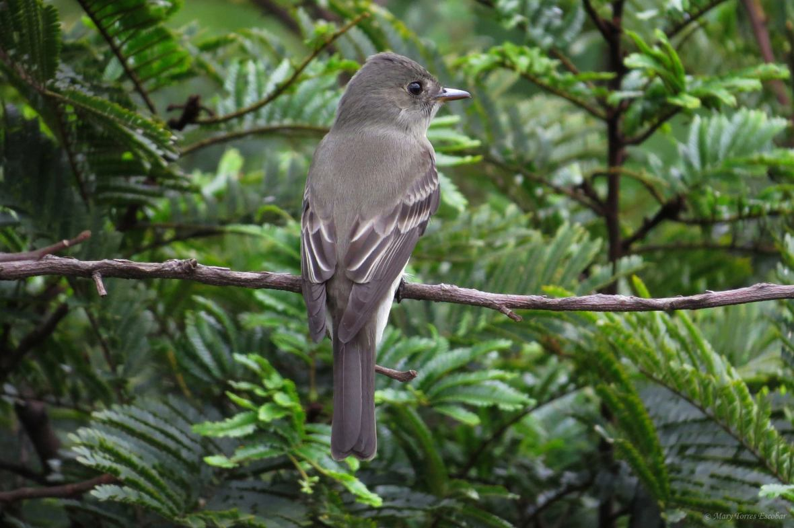

# CONTOPUS VIRENS, Cabanis — Wood Pewee.

The Wood Pewee, like most of its congeners, has a somewhat
extended habitat, ranging from the Atlantic westward to the Plains,
and from Texas to New Brunswick. It visits the United States
about the 15th of April, and from this time until its departure for
Guatemala in October, it is principally an occupant of highwooded regions with a scanty growth of underbrush, and timbered
river-bottoms.
But as the season advances, and the amatory feelings become
awakened, these shady retreats are deserted by a few individuals of
more venturesome disposition, and a temporary abiding-place is
sought for amid the stirring scenes of active farm-life. This
generally occurs during the last of May or the beginning of June,
and is the prelude to the more important act of mating, which
follows.
The assumption of matrimonial relations, however, is not a
matter that is entered into without more or less consideration.
Occasionally, much time is spent in its preparation. This is
presumably the case when a young female is courted by some
venerable male. But when an apparently experienced individual is
the object of his devotion, the state of things is different. His
advances are then either encouraged and reciprocated, or they are
declined, and the disappointed suitor compelled to seek a partner
elsewhere. It is probable, moreover, that the same birds pair
together on each return of the breeding-season, unless prevented by
death, or some other of the numerous vicissitudes of life.
The ceremony of mating being over—which business is
ordinarily of short continuance, seldom lasting for a greater period
than two days—the newly-wedded pair now set out to discover a
suitable place for the building of a home. This is a matter of
considerable moment, often requiring the performance of long and
extended tours of observation and exploration. These
reconnoissances generally last for a week, but eventually result in
the choice of a locality well adapted, as far as the essential
conditions of shelter and security are concerned, to become the 
depository of a nest. The site generally chosen for this important
purpose is a tall open woods with a preponderance of ash or oak
trees; but where a time-honored orchard is the recipient of this
favor, which is sometimes the case, the apple, 011 account of the
many advantages which it possesses, is preferred above all other
fruit-trees.
The site being mutually agreed upon, the happy pair proceed
with all possible dispatch and diligence to construct a domicile: the
male to collect and bring in the necessary materials; the female, to
fix them in their proper places, and also to give shape and
symmetry to the structure. The time devoted to this work varies
with the industry of the builders, the style of the nest, and the
character of the neighborhood. But, where the birds are laboring
under the most favorable circumstances, the task is easily
accomplished in five days.
This admirable piece of bird-architecture, which rivals in beauty
and symmetry the nest of our little Ruby-throated Humming-bird,
is either saddled upon a living or dead limb that is horizontal and
lichen-clad, or else upon the crotch of a bifurcated branch, and is
placed above the ground at elevations varying from five to thirty
feet. According to Nutt all, "the body of the fabric" occasionally
consists of "wiry grass or root fibres;" but we have yet to meet
with a nest with "small branching lichens held together with
cobwebs and caterpillars' silk, moistened with saliva," as that
author remarks. In a structure before us, which is typical in its
character, small strips of inner bark plucked from trees of chestnut
and oak, bits of tow, and fragments of wool, circularly arranged
and compactly pi-essed together, are the prevailing constituents.
Externally, it is closely invested with the bluish-gray crustaceous
lichens which are so plentiful upon the trunks of certain trees, and
also upon fence-rails. In diameter, it measures three and a half
inches; in height, one and a half inches. The width of the cavity is
about two inches; the depth in the centre, three-fourths of an inch.
The most beautiful fabric, as well as the most compactly built, 
which we have seen, was obtained in the spring of 1870, not far
from Germantown, Pa. It was placed upon a horizontal branch of
an apple-tree, in close proximity to a farm-house. Externally, it is
thickly covered with bluish-gray crustaceous lichens, which are
held in place by a few cobwebs, and fragments of the silk of
caterpillars. The base consists of dried stems of grasses, and on
these is reared a neat and cosy superstructure composed of the
inner fibres of the wild and cultivated species of the vine, and a
slight sprinkling of wool. These materials are variously
interwoven, and arranged around the margin so as to form a cavity.
The dimensions of this nest are as follows: External diameter, three
and a half inches; height, one and a half inches; width of cavity,
two inches; depth in the centre, three-fourths of an inch. In the
Plate it is represented the natural size—built upon an oak branch.
In the details of form and dimensions, this nest differs
immaterially from specimens which we have met with and seen
from other localities. But wherever obtained, they will always be
found to bear a very close resemblance to one another, differing
chiefly in the character of the articles which constitute the inner
arrangement. We will merely mention one example which was
taken by Mr. Welch, in Lynn, Mass., and which will give our
readers some faint conception of the extent to which variation is
often carried. This structure was placed upon a dead limb of a
forest-tree. Its walls were composed of small dry stems and
vegetable down, finely interwoven, and covered on the outside
with lichens which were cemented to it by a viscid secretion that
was apparently supplied by the builders. The base wras somewhat
flattened, much thinner than the walls, and composed of finer
materials. The external diameter was three inches, and the height
one and a half inches; the cavity, two and a half inches at the rim,
and the central depth about one inch.
Having finished their home, only a day or so intervenes when
oviposition becomes the controlling instinct. The female now
proceeds to deposit her complement of four eggs, which she does 
on consecutive days, at the rate of a single egg daily. This is
followed, on the day succeeding the last deposit, by the trying duty
of incubation. Upon the female devolves this arduous and irksome
labor. For about eleven days she is thus engaged, until her patience
is finally crowned with success. Although the male takes no part in
this duty, yet he contributes his share to the prosperity of the
undertaking, by guarding his partner from danger, and supplying
her with the essential articles of food. When his home is assailed
by feathered enemies, if they are not more than a match for his
strength, he is not slow to wreak instant vengeance upon them. But
in the case of human depredators, where effort would be futile, no
exertion is put forth to cause desistance from any contemplated
assault, save a little scolding.
The eggs are four in number, and resemble in configuration
those of the common Phoebe-Bird. They are obtuse at one
extremity, and slightly tapering at the other. The ground is a rich
cream-color, and is diversified about the larger end with a wreath
of purple and lilac spots, which are large, and occasionally
confluent. In length, they measure .76 of an inch, and in width .54.
It is pretty well established that but a single set is deposited by any
given pair of birds in a season. Nests with eggs, however, have
been taken during the last of July, or the beginning of August; but
whether a second laying or not, we cannot say—possibly the work
of birds whose early efforts had been frustrated.

